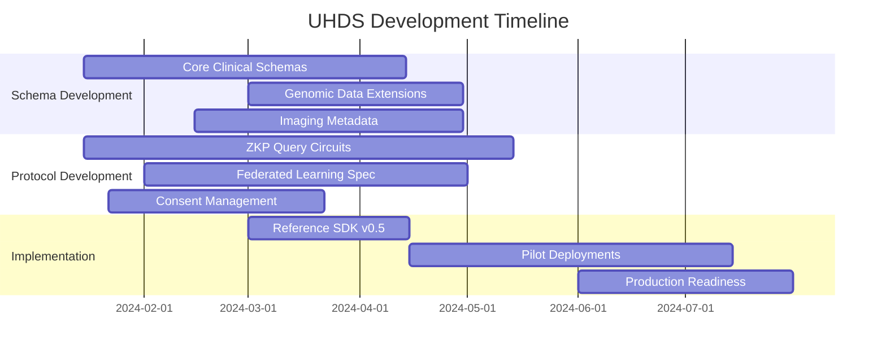

# Universal Health Data Schemas for Privacy-Preserving AI (UHDS)

[](https://www.w3.org/community/uhds/)
[](https://creativecommons.org/licenses/by/4.0/)
[](https://lists.w3.org/Archives/Public/public-uhds/)
[](https://github.com/w3c-cg/uhds)


## 🎯 Mission

The Universal Health Data Schemas for Privacy-Preserving AI (UHDS) Community Group aims to define a universal, modular, and interoperable set of data schemas for health information. Our goal is to enable the aggregation and utilization of data for medical research and AI training through privacy-enhancing technologies (PETs) like Zero-Knowledge Proofs (ZKPs) and Federated Learning, while ensuring patient control and consent via Verifiable Credentials (VCs) and Decentralized Identifiers (DIDs).

## 📋 Problem Statement

The development of robust medical AI is hampered by:

| Challenge | Impact |
|-----------|---------|
| **Siloed Health Data** | 30-40% of medical AI projects fail due to insufficient training data |
| **Incompatible Formats** | Healthcare systems use 50+ different data standards across institutions |
| **Privacy Regulations** | GDPR, HIPAA, and other regulations prevent raw data sharing |
| **Lack of Patient Control** | Patients have minimal say in how their data is used for research |
| **Trust Deficit** | Researchers cannot verify data authenticity without compromising privacy |

These barriers cost the healthcare industry an estimated **$300B annually** in lost research opportunities and inefficient data management.


## 🎯 Scope & Vision

We are creating standardized schemas that transform health data into **verifiable, privacy-preserving assets** enabling:

- ✅ **Secure Multi-Institutional Research**: Collaborate across hospitals without data leaving source institutions
- ✅ **Patient-Centric Control**: Granular consent management with audit trails
- ✅ **Privacy-by-Design**: Zero-knowledge proofs enable queries without data exposure
- ✅ **Regulatory Compliance**: Built-in mechanisms for GDPR, HIPAA, and emerging regulations
- ✅ **AI-Ready Data**: Structured, normalized, and quality-controlled data for ML pipelines

## 🎯 Key Deliverables

### 1. **Verifiable Credential Schemas** (Core Data Models)
Modular, extensible schemas for comprehensive health data coverage:

| Schema Category | Examples | Privacy Level |
|----------------|----------|---------------|
| **Laboratory Results** | CBC panels, metabolic panels, pathology reports | PII-stripped with hash-based linking |
| **Medical Imaging** | DICOM metadata, radiology findings, scan parameters | Metadata only, image references |
| **Clinical Documents** | Progress notes, discharge summaries, operative reports | De-identified with structural semantics |
| **Medications** | Prescriptions, administrations, adherence data | Time-series aggregates |
| **Diagnoses & Conditions** | ICD-10/11 codes, problem lists, severity scores | Coded data with temporal context |
| **Procedures & Interventions** | CPT codes, surgical details, device implants | Procedure metadata |
| **Vital Signs & Measurements** | BP, HR, SpO2, temperature trends | Statistical aggregates |
| **Genomic & Biomarker Data** | SNP arrays, gene expressions, proteomics | Differential privacy layers |

### 2. **Implementation Guidelines**
- **Issuer Frameworks**: Best practices for hospitals, clinics, and labs to issue VCs
- **Validator Specifications**: Protocols for credential verification and revocation
- **Interoperability Bridges**: Mapping standards to/from FHIR, HL7v2, DICOM, OMOP
- **Compliance Toolkits**: Templates for GDPR Art. 30 records, HIPAA BAAs

### 3. **Privacy-Enhancing Protocols**
- **ZKP Circuits**: Pre-built circuits for common medical queries (prevalence, correlations)
- **Secure Multi-Party Computation**: Protocols for distributed analytics
- **Homomorphic Encryption**: Standards for encrypted computation on health data
- **Differential Privacy**: Mechanisms for statistical disclosure control

### 4. **AI/ML Integration Patterns**
- **Federated Learning**: Standardized protocols for cross-institutional model training
- **Model Provenance**: Verifiable credentials for AI model lineage and validation
- **Fairness & Bias Detection**: Privacy-preserving bias assessment tools
- **Performance Benchmarks**: Standardized evaluation datasets and metrics


## 🏗️ Complete Architecture & Lifecycle

### End-to-End Workflow

```
┌─────────────────┐    ┌─────────────────┐    ┌─────────────────┐
│   Data Creation │    │   Credential    │    │   Consent &     │
│   & Capture     │───▶│   Issuance     │───▶│   Management    │
│   • EHR Systems │    │   • Hospital    │    │   • Patient     │
│   • Wearables   │    │   • Lab System  │    │   • Smart       │
│   • IoT Devices │    │   • Trusted     │    │   • Wallets     │
└─────────────────┘    │   • Sources     │    └─────────────────┘
                       └─────────────────┘            │
                                                      ▼
┌─────────────────┐    ┌─────────────────┐    ┌─────────────────┐
│   Research      │    │   Privacy-      │    │   AI Model      │
│   Results       │◀───│   Preserving   │◀───│   Training      │
│   • Publications│    │   Analytics     │    │   • Federated   │
│   • Insights    │    │   • ZKP Queries │    │   • Learning    │
│   • Alerts      │    │   • SMPC        │    │   • Transfer    │
└─────────────────┘    └─────────────────┘    └─────────────────┘
```

### Data Lifecycle Management

#### Phase 1: **Data Generation & Capture**
```yaml
source_systems:
  - electronic_health_records:
      standards: [FHIR_R4, HL7v2, CDA]
      extraction: real_time_batch
      validation: schema_validation + clinical_validation
  - medical_devices:
      protocols: [DICOM, IEEE_11073, Bluetooth_Health]
      sampling: configurable_intervals
  - patient_reported:
      modalities: [mobile_apps, web_portals, voice_interfaces]
      verification: multi_factor_auth
```

#### Phase 2: **Credential Issuance & Signing**
```yaml
issuance_pipeline:
  step_1: data_normalization
    - format_conversion: source→intermediate_schema
    - value_sets: SNOMED_CT, LOINC, RxNorm mappings
  step_2: privacy_transforms
    - de_identification: [hipaa_safe_harbor, dates_offset]
    - aggregation: [time_buckets, categorical_groups]
  step_3: credential_creation
    - schema: UHDS_BaseCredential
    - proofs: issuer_signature + timestamp_chain
    - metadata: provenance + data_quality_scores
```

#### Phase 3: **Consent Management & Access Control**
```yaml
consent_framework:
  granularity_levels:
    - data_category: [labs, imaging, medications]
    - purpose: [research_type_a, clinical_trial_b]
    - temporal: [start_date, end_date, renewal_rules]
    - computational: [aggregation_only, no_derivatives]
  
  enforcement_mechanisms:
    - smart_contracts: automated_compliance_checking
    - policy_engines: XACML + ABAC rules
    - audit_trails: immutable_logging + patient_portal
```

#### Phase 4: **Privacy-Preserving Analytics**
```yaml
query_types:
  statistical:
    - count_queries: [cohort_size, prevalence_rates]
    - correlation: [symptoms_outcomes, drug_effects]
    - survival_analysis: [kaplan_meier, cox_regression]
  
  machine_learning:
    - federated_training: [horizontal, vertical, transfer]
    - inference: [model_serving_with_privacy_guarantees]
    - validation: [cross_institutional_testing]
  
  privacy_guarantees:
    - zero_knowledge: query_reveals_only_result
    - differential_privacy: (ε,δ)-privacy_parameters
    - secure_enclaves: trusted_execution_environments
```

### Access Management Framework

#### Identity & Authentication Layer
```yaml
identity_stack:
  patient_identities:
    - primary: decentralized_identifiers (DIDs)
    - aliases: pseudonymous_identifiers_per_context
    - recovery: social_recovery + guardianship
  
  institutional_identities:
    - accreditation: trust_registry_credentials
    - roles: [clinician, researcher, administrator]
    - delegations: temporary_access_grants
  
  authentication:
    - multi_factor: [biometrics, hardware_keys, OTP]
    - continuous: behavioral_analytics + risk_scoring
    - revocation: real_time_status_checking
```

#### Authorization & Policy Engine
```yaml
authorization_model:
  policy_language: rego + cedar
  attributes:
    - subject: [role, affiliation, certifications]
    - resource: [data_sensitivity, age, category]
    - environment: [time, location, device_security]
    - action: [read, compute, aggregate, export]
  
  decision_points:
    - pre_query: purpose_validation + rate_limiting
    - during_computation: privacy_budget_tracking
    - post_result: disclosure_control_checking
```

## 📂 Repository Structure

```
├── specifications/              # Formal specifications
│   ├── credentials/            # VC schemas by data type
│   │   ├── laboratory/         # Lab results schemas
│   │   ├── imaging/           # Medical imaging schemas
│   │   ├── clinical/          # Clinical documents
│   │   └── genomics/          # Genomic data schemas
│   ├── proofs/                # ZKP circuit specifications
│   │   ├── statistical/       # Stats queries
│   │   ├── ml/               # ML training circuits
│   │   └── validation/       # Data validation proofs
│   ├── protocols/             # Interaction protocols
│   │   ├── issuance/         # Credential issuance
│   │   ├── consent/          # Consent management
│   │   ├── query/            # Privacy-preserving queries
│   │   └── federation/       # Federated learning protocols
│   └── interoperability/      # Mapping to existing standards
│       ├── fhir/             # FHIR mappings
│       ├── dicom/            # DICOM mappings
│       └── hl7/              # HL7 mappings
├── implementations/           # Reference implementations
│   ├── typescript/           # Node.js/TypeScript SDK
│   ├── python/               # Python SDK & tools
│   ├── rust/                 # High-performance components
│   ├── solidity/             # Smart contracts (if applicable)
│   └── mobile/               # Mobile wallet integrations
├── use-cases/                # Detailed use cases
│   ├── clinical-trials/      # Multi-site trial recruitment
│   ├│   └── patient-matching/ # Privacy-prescreening
│   ├│   └── safety-monitoring/ # Adverse event detection
│   ├── public-health/        # Disease surveillance
│   ├│   └── outbreak-detection/ # Early warning systems
│   ├│   └── vaccination-effectiveness/
│   ├── precision-medicine/   # Personalized treatment
│   ├│   └── biomarker-discovery/
│   └│   └── treatment-response-prediction/
├── guidelines/               # Best practices
│   ├── issuers.md           # For healthcare institutions
│   ├── validators.md        # For data consumers
│   ├── privacy-risk-assessment.md
│   ├│   └── dpias/          # Data Protection Impact Assessments
│   ├── compliance/          # Regulatory compliance
│   ├│   └── hipaa/          # HIPAA guidance
│   ├│   └── gdpr/           # GDPR guidance
│   └── security/            # Security best practices
├── tools/                   # Development tools
│   ├── schema-validator/    # Schema validation tools
│   ├── zkp-generator/       # ZKP circuit generators
│   ├── compliance-checker/  # Regulatory compliance checker
│   └── data-anonymizer/     # Privacy-preserving transformers
├── tests/                   # Test suites
│   ├── unit/               # Unit tests
│   ├│   └── schemas/       # Schema validation tests
│   ├│   └── proofs/        # ZKP circuit tests
│   ├── integration/        # Integration tests
│   ├│   └── end-to-end/    # Complete workflow tests
│   ├│   └── interoperability/ # Standards compatibility
│   └── performance/        # Performance benchmarks
│       └── scalability/    # Large-scale testing
└── governance/             # Project governance
    ├── charter.md          # Group charter
    ├── contribution-guide.md
    ├── code-of-conduct.md
    └── decision-records/   # Architecture decision records
```

## 🚀 Getting Started

### Quick Start for Different Stakeholders

#### For Healthcare Institutions (Data Issuers)
```bash
# 1. Install UHDS Issuer Toolkit
npm install @uhds/issuer-toolkit

# 2. Configure your institution profile
uhds configure --institution "General Hospital" \
               --accreditation "JCI" \
               --trust-registry "w3c-uhds"

# 3. Generate your first credentials
uhds issue --source fhir --format laboratory \
           --patient-consent verified \
           --output-dir ./credentials/
```

#### For Researchers (Data Consumers)
```bash
# 1. Install UHDS Researcher SDK
pip install uhds-researcher

# 2. Define your research query
from uhds import PrivacyPreservingQuery

query = PrivacyPreservingQuery(
    cohort_criteria={"diagnosis": "Type 2 Diabetes"},
    analysis_type="prevalence_by_age_group",
    privacy_budget=epsilon=0.1, delta=1e-5
)

# 3. Execute across multiple institutions
results = query.execute_zkp(
    institutions=["hospital-a", "hospital-b", "clinic-c"],
    consent_verified=True
)
```

#### For Developers (System Integrators)
```bash
# 1. Clone and explore the repository
git clone https://github.com/w3c-cg/uhds.git
cd uhds

# 2. Set up development environment
make setup-dev
# Installs all dependencies and configures test environments

# 3. Run the demo workflow
make run-demo
# Demonstrates complete issuance → consent → query → result flow
```

### Step-by-Step Implementation Guide

#### Phase 1: Assessment & Planning
1. **Data Inventory**: Catalog existing health data systems
2. **Compliance Review**: Map regulatory requirements to UHDS features
3. **Stakeholder Alignment**: Engage clinical, IT, legal, and patient groups
4. **Pilot Selection**: Identify low-risk, high-impact use case

#### Phase 2: Technical Integration
1. **Schema Mapping**: Map existing data to UHDS schemas
2. **Issuer Setup**: Deploy credential issuance infrastructure
3. **Consent Framework**: Implement patient consent management
4. **Query Interface**: Set up privacy-preserving analytics

#### Phase 3: Deployment & Scaling
1. **Pilot Execution**: Run controlled pilot with monitoring
2. **Performance Tuning**: Optimize for scale and latency
3. **Security Audit**: Conduct penetration testing
4. **Production Rollout**: Gradual expansion with feedback loops

## 🤝 How to Contribute

### Contribution Pathways

| Pathway | Activities | Time Commitment |
|---------|------------|-----------------|
| **Schema Design** | Define new data schemas, extend existing ones | 2-4 hours/week |
| **Protocol Development** | Implement ZKP circuits, federated learning protocols | 4-8 hours/week |
| **Standards Alignment** | Map UHDS to FHIR/DICOM/HL7, ensure interoperability | 2-6 hours/week |
| **Use Case Development** | Document real-world applications, create demos | 1-3 hours/week |
| **Governance & Policy** | Develop compliance frameworks, ethical guidelines | 2-4 hours/week |

### Contribution Process
1. **Join the W3C Community Group**: [https://www.w3.org/community/uhds/](https://www.w3.org/community/uhds/)
2. **Subscribe to Mailing List**: [public-uhds@w3.org](mailto:public-uhds@w3.org) ([Archives](https://lists.w3.org/Archives/Public/public-uhds/))
3. **Review Active Discussions**: Check GitHub Issues and Pull Requests
4. **Attend Meetings**: Join our bi-weekly syncs (see Calendar below)
5. **Submit Contributions**:
   - Small fixes: Direct PRs to relevant directories
   - New features: Create Issue first for discussion
   - Major changes: Submit Proposal Document for review

### Contributor Onboarding
```yaml
new_contributor_journey:
  week_1:
    - join_mailing_list: "Introduce yourself!"
    - attend_community_call: "Get to know the team"
    - review_good_first_issues: "Pick a starter task"
  
  week_2_4:
    - complete_first_pr: "With mentor guidance"
    - join_special_interest_group: "Based on expertise"
    - contribute_to_discussions: "Mailing list or GitHub"
  
  month_2_3:
    - lead_small_feature: "With team support"
    - review_others_prs: "Learn through code review"
    - present_at_meeting: "Share your work"
```

## 📅 Meetings & Calendar

### Regular Schedule
- **Bi-weekly Plenary**: Tuesdays, 15:00 UTC ([Calendar](https://www.w3.org/groups/cg/uhds/calendar))
- **Technical Working Group**: Thursdays, 14:00 UTC
- **Healthcare Advisory Board**: First Monday, 16:00 UTC
- **Community Office Hours**: Fridays, 09:00 & 20:00 UTC

### Upcoming Key Milestones


## 📚 Resources & Documentation

### Essential Reading
- **Getting Started Guide**: `/docs/getting-started.md`
- **Architecture Deep Dive**: `/docs/architecture/overview.md`
- **Privacy & Security Model**: `/docs/security/privacy-model.md`
- **Compliance Handbook**: `/docs/compliance/overview.md`

### Tutorials & Examples
- **End-to-End Tutorial**: Build a research study from scratch
- **Hospital Integration Guide**: Connect existing EHR systems
- **Researcher Toolkit**: Privacy-preserving analysis examples
- **Patient App Development**: Build consent management interfaces

### Related Standards Integration

| Standard | Integration Level | Documentation |
|----------|-------------------|---------------|
| **HL7 FHIR** | Native support for FHIR Resources → UHDS VCs | `/specs/interoperability/fhir/` |
| **DICOM** | Metadata extraction and anonymization | `/specs/interoperability/dicom/` |
| **W3C VCs** | Base credential format compliance | `/specs/credentials/base-schema.md` |
| **ISO 27001** | Security control mappings | `/docs/compliance/iso-27001.md` |

## 🛡️ Privacy & Security Framework

### Core Privacy Principles
1. **Data Minimization**: Collect only what's needed, store only what's necessary
2. **Purpose Limitation**: Strict enforcement of consented use cases
3. **Storage Limitation**: Automatic expiration and deletion policies
4. **Integrity & Confidentiality**: End-to-end encryption and tamper evidence
5. **Accountability**: Comprehensive audit trails and transparency reports

### Security Architecture
```yaml
defense_in_depth:
  layer_1: network_security
    - zero_trust_architecture: "never trust, always verify"
    - microsegmentation: "isolate credential issuance from queries"
  
  layer_2: application_security
    - secure_coding: OWASP_top_10_compliance
    - dependency_scanning: weekly_vulnerability_checks
  
  layer_3: data_security
    - encryption: at_rest + in_transit + in_use
    - key_management: HSM_backed + automated_rotation
  
  layer_4: operational_security
    - monitoring: 24/7_SIEM_with_alerting
    - incident_response: automated_playbooks
```

### Compliance & Certifications
- **Regulatory**: GDPR, HIPAA, PIPEDA, APPs
- **Industry**: HITRUST CSF, ISO 27001/27701
- **Technical**: FIPS 140-2, Common Criteria
- **Ethical**: IRB approvals, patient advisory board oversight

## 🌍 Governance & Sustainability

### Steering Committee
Composed of representatives from:
- Healthcare institutions (40%)
- Patient advocacy groups (20%)
- Academic/research organizations (20%)
- Technology partners (20%)

### Decision Making Process
1. **Proposal**: Documented in GitHub with use cases and impact analysis
2. **Discussion**: Mailing list discussion (minimum 2 weeks)
3. **Implementation**: Reference implementation with tests
4. **Ratification**: Steering committee vote (simple majority)
5. **Publication**: Released as part of specification

### Sustainability Model
- **Open Governance**: Transparent decision making
- **Multi-stakeholder Funding**: Membership dues + grants
- **Commercial Ecosystem**: Certified implementation partners
- **Academic Partnerships**: Research collaborations

## 📊 Success Metrics & Impact Tracking

| Metric | Target | Current |
|--------|---------|---------|
| **Institutions Using UHDS** | 50+ by end of Year 2 | 0 (baseline) |
| **Patient Credentials Issued** | 1M+ by Year 3 | 0 (baseline) |
| **Research Studies Enabled** | 100+ by Year 2 | 0 (baseline) |
| **Query Response Time** | < 2 seconds for basic stats | TBD |
| **Privacy Budget Efficiency** | 30% improvement over baseline | TBD |
| **Interoperability Score** | 95%+ FHIR compatibility | TBD |

## 🔗 Connect & Collaborate

### Primary Channels
- **W3C Community Group**: [https://www.w3.org/community/uhds/](https://www.w3.org/community/uhds/)
- **Mailing List**: [public-uhds@w3.org](mailto:public-uhds@w3.org)
- **Archives**: [https://lists.w3.org/Archives/Public/public-uhds/](https://lists.w3.org/Archives/Public/public-uhds/)
- **GitHub Repository**: [https://github.com/w3c-cg/uhds](https://github.com/w3c-cg/uhds)
- **Issue Tracker**: [https://github.com/w3c-cg/uhds/issues](https://github.com/w3c-cg/uhds/issues)

### Special Interest Groups
- **Clinical Data Models**: clinical-sig@lists.w3.org
- **Privacy Technologies**: privacy-sig@lists.w3.org
- **AI/ML Integration**: ai-sig@lists.w3.org
- **Regulatory Compliance**: compliance-sig@lists.w3.org

### Office Hours & Support
- **Technical Support**: Wednesdays, 10:00-12:00 UTC
- **Healthcare Integration**: Tuesdays, 14:00-16:00 UTC
- **Compliance Guidance**: Fridays, 13:00-15:00 UTC

## 📄 License & Intellectual Property

This work is licensed under a [Creative Commons Attribution 4.0 International License](https://creativecommons.org/licenses/by/4.0/).

All contributions are made under the [W3C Community Contributor License Agreement (CLA)](https://www.w3.org/community/about/agreements/cla/).

### Patent Policy
This Community Group operates under the [W3C Community Group Patent Policy](https://www.w3.org/community/about/agreements/cla/).

## 🙏 Acknowledgments & Partners

### Founding Members
- [List of founding healthcare institutions]
- [Academic research partners]
- [Technology implementation partners]
- [Patient advocacy organizations]

### Funding & Support
- Initial development supported by [grantors/funders]
- Infrastructure provided by [cloud/hosting partners]
- Legal and compliance guidance from [legal partners]

---

*Building the future of privacy-preserving healthcare AI, together. Join us in creating standards that protect patients while advancing medicine.*

**📬 Stay Updated**: Subscribe to our [low-volume announcement list](mailto:uhds-announce@lists.w3.org) for major updates and milestones.

**🐦 Follow Progress**: Track development on our [GitHub project board](https://github.com/orgs/w3c-cg/projects/1).

**🎯 Get Involved**: Start with a ["good first issue"](https://github.com/w3c-cg/uhds/issues?q=is%3Aissue+is%3Aopen+label%3A%22good+first+issue%22) today!