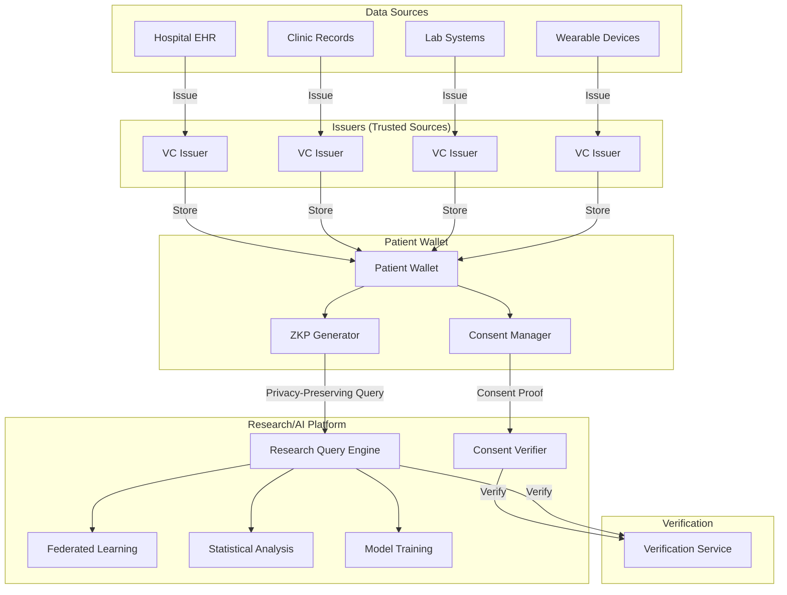
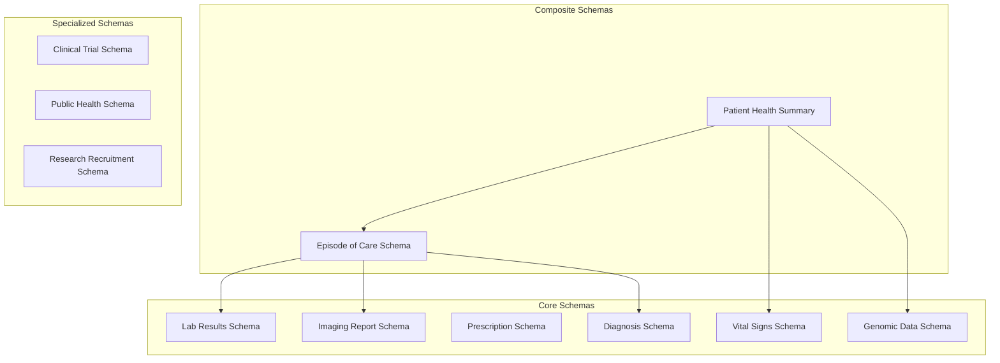
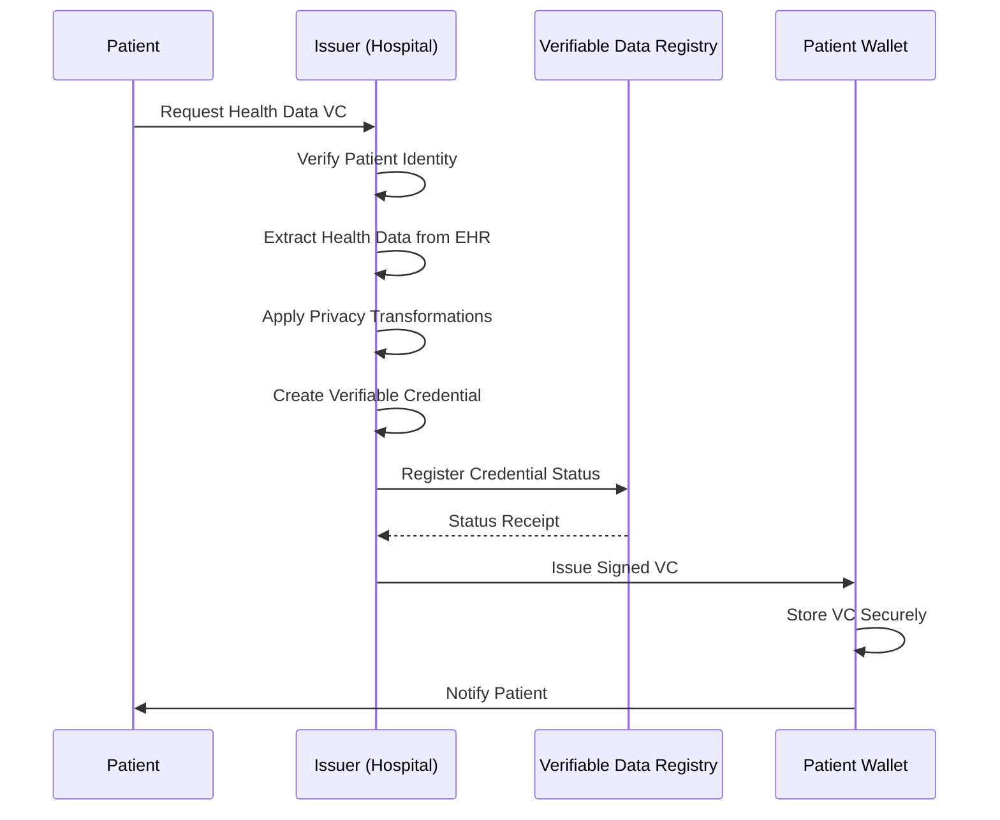
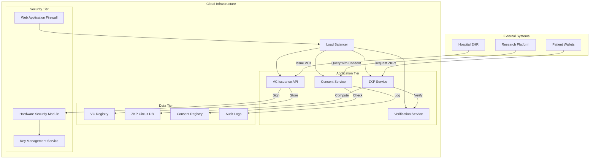
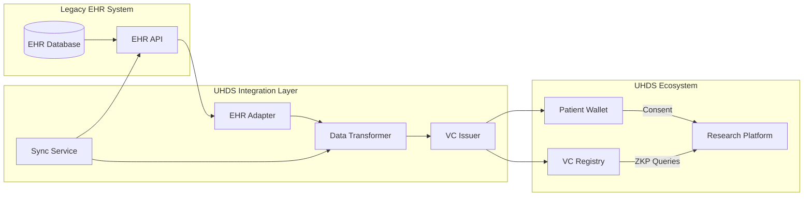

# Universal Health Data Schemas with Verifiable Credentials
## W3C Community Group Draft Report

**Editors:**
- Specification Editor (Organization/Affiliation)
- Additional Editor (Organization/Affiliation)

**Version:** 1.0.0
**Latest Version:** https://specs.w3c.org/uhds-vc/
**Previous Version:** None
**Shortname:** uhds-vc
**Status:** CG-DRAFT
**Abstract:** This specification defines a universal, modular, and interoperable set of data schemas for health information that enables aggregation and utilization of data for medical research and AI training through privacy-enhancing technologies (PETs) like Zero-Knowledge Proofs (ZKPs), while ensuring patient control and consent via Verifiable Credentials (VCs).
**Date:** 2025-01-15
**Repository:** https://github.com/w3c/uhds-vc-spec

---

## 1. Introduction

### 1.1 Problem Statement

The development of robust medical AI is currently hampered by several critical challenges:

1. **Data Silos**: Health data exists in incompatible formats across institutions
2. **Privacy Barriers**: Regulations prevent sharing of raw sensitive health data
3. **Lack of Standardization**: No universal schemas for medical data exchange
4. **Patient Agency**: Limited patient control over their health data usage
5. **Research Limitations**: Collaborative medical research is impeded by these barriers

### 1.2 Solution Overview

This specification addresses these challenges through:

1. **Verifiable Credentials (VCs)** for standardized, cryptographically verifiable health data
2. **Zero-Knowledge Proofs (ZKPs)** for privacy-preserving data queries and analytics
3. **Universal Health Data Schemas (UHDS)** for consistent data representation
4. **Patient-Centric Architecture** ensuring data ownership and consent management

### 1.3 Design Principles

- **Modularity**: Schemas can be combined and extended as needed
- **Privacy-by-Design**: ZKPs and encryption are integral, not add-ons
- **Patient Sovereignty**: Individuals control their health data
- **Interoperability**: Works across institutions and jurisdictions
- **Verifiability**: All claims are cryptographically verifiable

## 2. Architecture Overview

### 2.1 System Architecture



### 2.2 Core Components

1. **Verifiable Credentials (VCs)**: Standardized health data claims
2. **Zero-Knowledge Proofs (ZKPs)**: Privacy-preserving data operations
3. **Universal Schemas**: Consistent data representation
4. **Consent Framework**: Patient-controlled data sharing
5. **Trust Framework**: Issuer verification and validation

## 3. Verifiable Credential Schemas

### 3.1 Base Credential Structure

All health VCs follow this base structure:

```json
{
  "@context": [
    "https://www.w3.org/2018/credentials/v1",
    "https://specs.w3c.org/uhds-vc/context/v1"
  ],
  "id": "urn:uuid:123e4567-e89b-12d3-a456-426614174000",
  "type": ["VerifiableCredential", "HealthCredential"],
  "issuer": {
    "id": "did:web:examplehospital.org",
    "name": "Example General Hospital"
  },
  "issuanceDate": "2024-01-15T10:30:00Z",
  "expirationDate": "2025-01-15T10:30:00Z",
  "credentialSubject": {
    "id": "did:patient:12345",
    "healthData": {
      // Schema-specific data goes here
    }
  },
  "credentialSchema": {
    "id": "https://specs.w3c.org/uhds-vc/schemas/lab-result/v1",
    "type": "JsonSchemaValidator2021"
  },
  "proof": {
    "type": "Ed25519Signature2020",
    "created": "2024-01-15T10:30:00Z",
    "verificationMethod": "did:web:examplehospital.org#key-1",
    "proofPurpose": "assertionMethod",
    "proofValue": "z4oey5q2M3XKaxup3tmzN... (signature)"
  }
}
```

### 3.2 Modular Schema Architecture

#### 3.2.1 Core Health Data Types



### 3.3 Detailed Schema Specifications

#### 3.3.1 Lab Results Schema

```json
{
  "$schema": "https://json-schema.org/draft/2020-12/schema",
  "$id": "https://specs.w3c.org/uhds-vc/schemas/lab-result/v1",
  "title": "Laboratory Test Result",
  "description": "Standardized schema for laboratory test results",
  "type": "object",
  "properties": {
    "testType": {
      "type": "string",
      "enum": ["CBC", "CMP", "LipidPanel", "HbA1c", "TSH", "CRP", "Other"],
      "description": "Type of laboratory test performed"
    },
    "testName": {
      "type": "string",
      "description": "Specific name of the test"
    },
    "result": {
      "type": ["number", "string", "boolean"],
      "description": "Test result value"
    },
    "unit": {
      "type": "string",
      "description": "Unit of measurement"
    },
    "referenceRange": {
      "type": "object",
      "properties": {
        "low": { "type": "number" },
        "high": { "type": "number" },
        "text": { "type": "string" }
      }
    },
    "specimenType": {
      "type": "string",
      "enum": ["Blood", "Urine", "Saliva", "Tissue", "Other"]
    },
    "collectionDate": {
      "type": "string",
      "format": "date-time"
    },
    "resultDate": {
      "type": "string",
      "format": "date-time"
    },
    "performingLab": {
      "type": "object",
      "properties": {
        "name": { "type": "string" },
        "cliaNumber": { "type": "string" },
        "location": { "type": "string" }
      }
    },
    "interpretation": {
      "type": "string",
      "enum": ["Normal", "Abnormal", "Critical", "Inconclusive"]
    }
  },
  "required": ["testType", "result", "collectionDate", "resultDate"]
}
```

#### 3.3.2 Imaging Report Schema

```json
{
  "$id": "https://specs.w3c.org/uhds-vc/schemas/imaging-report/v1",
  "title": "Medical Imaging Report",
  "description": "Standardized schema for medical imaging reports",
  "type": "object",
  "properties": {
    "modality": {
      "type": "string",
      "enum": ["X-Ray", "CT", "MRI", "Ultrasound", "PET", "Mammography"]
    },
    "bodyPart": {
      "type": "string",
      "description": "Anatomical location imaged"
    },
    "procedure": {
      "type": "string",
      "description": "Specific imaging procedure performed"
    },
    "findings": {
      "type": "array",
      "items": {
        "type": "object",
        "properties": {
          "description": { "type": "string" },
          "birads": { "type": "integer", "minimum": 0, "maximum": 6 },
          "location": { "type": "string" },
          "size": { "type": "string" }
        }
      }
    },
    "impression": {
      "type": "string",
      "description": "Radiologist's interpretation"
    },
    "recommendations": {
      "type": "array",
      "items": { "type": "string" }
    },
    "imagingDate": {
      "type": "string",
      "format": "date-time"
    },
    "reportDate": {
      "type": "string",
      "format": "date-time"
    },
    "radiologist": {
      "type": "object",
      "properties": {
        "name": { "type": "string" },
        "licenseNumber": { "type": "string" },
        "npi": { "type": "string" }
      }
    }
  },
  "required": ["modality", "bodyPart", "imagingDate", "reportDate"]
}
```

#### 3.3.3 Diagnosis Schema

```json
{
  "$id": "https://specs.w3c.org/uhds-vc/schemas/diagnosis/v1",
  "title": "Medical Diagnosis",
  "description": "Standardized schema for medical diagnoses",
  "type": "object",
  "properties": {
    "codeSystem": {
      "type": "string",
      "enum": ["ICD-10", "ICD-11", "SNOMED-CT", "LOINC", "Other"]
    },
    "code": {
      "type": "string",
      "description": "Diagnosis code from the specified system"
    },
    "description": {
      "type": "string",
      "description": "Human-readable diagnosis description"
    },
    "certainty": {
      "type": "string",
      "enum": ["Confirmed", "Probable", "Possible", "Rule-out"]
    },
    "onsetDate": {
      "type": "string",
      "format": "date"
    },
    "abatementDate": {
      "type": "string",
      "format": "date"
    },
    "severity": {
      "type": "string",
      "enum": ["Mild", "Moderate", "Severe", "Critical"]
    },
    "clinicalStatus": {
      "type": "string",
      "enum": ["Active", "Recurrence", "Relapse", "Inactive", "Remission", "Resolved"]
    },
    "verificationStatus": {
      "type": "string",
      "enum": ["Provisional", "Differential", "Confirmed", "Refuted", "Entered-in-error"]
    },
    "bodySite": {
      "type": "array",
      "items": { "type": "string" },
      "description": "Affected anatomical locations"
    }
  },
  "required": ["codeSystem", "code", "description", "clinicalStatus"]
}
```

## 4. Zero-Knowledge Proof Protocols

### 4.1 ZKP Types for Health Data

#### 4.1.1 Range Proofs
Prove a value is within a range without revealing the value:
- Age is between 18-65
- Blood pressure is normal range
- Cholesterol levels are above threshold

#### 4.1.2 Set Membership Proofs
Prove membership in a set without revealing specific data:
- Patient has one of specified conditions
- Belongs to a demographic group
- Has taken specific medications

#### 4.1.3 Computational Proofs
Prove computation results without revealing inputs:
- BMI calculation from height/weight
- Risk score calculation
- Treatment efficacy metrics

#### 4.1.4 Consent Proofs
Prove patient consent for specific data uses:
- Consent for research participation
- Consent for data aggregation
- Temporal consent validity

### 4.2 ZKP Implementation Patterns

#### 4.2.1 zk-SNARKs for Statistical Queries

```javascript
// Example: Prove average age > 50 without revealing individual ages
const ageZKP = {
  circuit: "statistical_range.circom",
  publicInputs: {
    minAge: 50,
    sampleSize: 1000,
    populationHash: "0xabc123..."
  },
  privateInputs: {
    ages: [/* encrypted ages */],
    consentProofs: [/* individual consent proofs */]
  },
  proof: "zk-proof-data..."
};
```

#### 4.2.2 Bulletproofs for Range Queries

```javascript
// Prove lab result is within normal range
const labResultZKP = {
  type: "Bulletproof",
  statement: "Hemoglobin A1c < 6.5%",
  publicParams: {
    upperBound: 6.5,
    unit: "%",
    testType: "HbA1c"
  },
  commitment: "pedersen-commitment...",
  proof: "bulletproof-data..."
};
```

### 4.3 Privacy-Preserving Analytics Protocols

#### 4.3.1 Differential Privacy with ZKPs

```python
class DifferentialPrivateZKP:
    """Combine differential privacy with zero-knowledge proofs"""
    
    def generate_proof(self, data, epsilon, delta):
        """
        Generate ZKP that computation satisfies (ε,δ)-differential privacy
        
        Args:
            data: Private dataset
            epsilon: Privacy parameter
            delta: Failure probability
        
        Returns:
            ZKP that noise was added appropriately
        """
        # Add Laplace or Gaussian noise
        noisy_result = self.add_dp_noise(data, epsilon, delta)
        
        # Generate ZKP that noise was properly added
        proof = self.generate_noise_addition_proof(
            data_commitment, 
            noisy_result,
            epsilon,
            delta
        )
        
        return noisy_result, proof
```

#### 4.3.2 Federated Learning with ZKP Verification

```python
class FederatedLearningZKP:
    """ZKP verification for federated learning updates"""
    
    def verify_model_update(self, model_update, data_stats_proof):
        """
        Verify model update without seeing raw data
        
        Args:
            model_update: Encrypted model gradients
            data_stats_proof: ZKP of data statistics used
        
        Returns:
            Verification result
        """
        # Verify data statistics proof
        if not self.verify_stats_proof(data_stats_proof):
            return False
        
        # Verify model update consistency with claimed stats
        update_proof = self.verify_update_consistency(
            model_update,
            data_stats_proof.public_inputs
        )
        
        return update_proof.is_valid
```

## 5. Consent Management Framework

### 5.1 Consent Credential Schema

```json
{
  "$id": "https://specs.w3c.org/uhds-vc/schemas/consent/v1",
  "title": "Data Usage Consent",
  "description": "Standardized schema for health data usage consent",
  "type": "object",
  "properties": {
    "consentId": {
      "type": "string",
      "format": "uuid"
    },
    "purpose": {
      "type": "string",
      "enum": ["Research", "ClinicalCare", "QualityImprovement", "PublicHealth"]
    },
    "dataTypes": {
      "type": "array",
      "items": {
        "type": "string",
        "enum": ["LabResults", "Diagnoses", "Medications", "GenomicData"]
      }
    },
    "processingType": {
      "type": "string",
      "enum": ["Aggregation", "Anonymization", "Pseudonymization", "Identified"]
    },
    "recipients": {
      "type": "array",
      "items": {
        "type": "object",
        "properties": {
          "organization": { "type": "string" },
          "purpose": { "type": "string" },
          "dataUseLimitations": { "type": "string" }
        }
      }
    },
    "validFrom": {
      "type": "string",
      "format": "date-time"
    },
    "validUntil": {
      "type": "string",
      "format": "date-time"
    },
    "revocationConditions": {
      "type": "array",
      "items": { "type": "string" }
    },
    "withdrawalProcedure": {
      "type": "string"
    }
  },
  "required": ["purpose", "dataTypes", "validFrom"]
}
```

### 5.2 Consent Verification Protocols

#### 5.2.1 Selective Disclosure ZKPs

```typescript
interface SelectiveDisclosureProof {
  // Prove consent for specific data attributes
  disclosedAttributes: string[];
  undisclosedAttributes: string[];
  proof: ZeroKnowledgeProof;
  
  // Prove consent validity
  consentValid: boolean;
  expirationCheck: RangeProof;
  
  // Prove purpose match
  purposeMatch: boolean;
  recipientVerification: boolean;
}
```

#### 5.2.2 Revocation Management

```solidity
// Smart contract for consent revocation
contract ConsentRegistry {
    mapping(bytes32 => ConsentStatus) private consents;
    
    struct ConsentStatus {
        address patient;
        bytes32 consentHash;
        bool isActive;
        uint256 validUntil;
        uint256 revokedAt;
    }
    
    function revokeConsent(bytes32 consentId) external {
        require(
            consents[consentId].patient == msg.sender,
            "Only patient can revoke"
        );
        consents[consentId].isActive = false;
        consents[consentId].revokedAt = block.timestamp;
        emit ConsentRevoked(consentId, msg.sender);
    }
    
    function verifyConsent(
        bytes32 consentId,
        bytes32 proof
    ) external view returns (bool) {
        ConsentStatus memory status = consents[consentId];
        return status.isActive && 
               block.timestamp <= status.validUntil &&
               verifyZeroKnowledgeProof(proof);
    }
}
```

## 6. Issuer Guidelines and Trust Framework

### 6.1 Trusted Issuer Requirements

#### 6.1.1 Institutional Issuers (Hospitals, Clinics)

```json
{
  "issuerRequirements": {
    "accreditation": {
      "required": ["JCI", "CAP", "CLIA"],
      "verificationMethod": "DID-Web"
    },
    "identityVerification": {
      "method": "OIDC",
      "level": "IAL2/AAL2"
    },
    "dataIntegrity": {
      "auditTrail": true,
      "tamperEvidence": "Blockchain",
      "retentionPolicy": "10 years"
    },
    "privacyCompliance": {
      "regulations": ["HIPAA", "GDPR", "CCPA"],
      "dataMinimization": true,
      "purposeLimitation": true
    }
  }
}
```

#### 6.1.2 Individual Health Device Issuers

```json
{
  "deviceIssuerRequirements": {
    "deviceCertification": {
      "standards": ["ISO-13485", "FDA-510k", "CE-Mark"],
      "calibration": "Annual"
    },
    "dataProvenance": {
      "timestamping": "Secure",
      "locationTracking": "Optional",
      "operatorVerification": "Required"
    },
    "qualityAssurance": {
      "accuracyTolerance": "±2%",
      "precisionRequirements": "Specified",
      "maintenanceLogs": "Required"
    }
  }
}
```

### 6.2 Credential Issuance Protocol



## 7. Research and AI Training Use Cases

### 7.1 Privacy-Preserving Clinical Trials

#### 7.1.1 Eligibility Screening with ZKPs

```python
class TrialEligibilityZKP:
    """Zero-knowledge eligibility verification for clinical trials"""
    
    def check_eligibility(self, patient_vcs, trial_criteria):
        """
        Check if patient meets trial criteria without revealing specifics
        
        Args:
            patient_vcs: Patient's verifiable credentials
            trial_criteria: Trial inclusion/exclusion criteria
        
        Returns:
            Eligibility proof and encrypted match result
        """
        proofs = []
        
        for criterion in trial_criteria:
            if criterion.type == "age":
                proof = self.generate_age_proof(
                    patient_vcs.demographics,
                    criterion.min_age,
                    criterion.max_age
                )
                proofs.append(proof)
            
            elif criterion.type == "diagnosis":
                proof = self.generate_diagnosis_proof(
                    patient_vcs.diagnoses,
                    criterion.required_diagnoses,
                    criterion.exclusion_diagnoses
                )
                proofs.append(proof)
            
            elif criterion.type == "lab_values":
                proof = self.generate_lab_proof(
                    patient_vcs.lab_results,
                    criterion.test_type,
                    criterion.min_value,
                    criterion.max_value
                )
                proofs.append(proof)
        
        # Aggregate proofs
        aggregated_proof = self.aggregate_proofs(proofs)
        
        # Return eligibility without revealing which criteria were met
        return {
            "eligible": aggregated_proof.is_valid,
            "proof": aggregated_proof,
            "encrypted_match_details": self.encrypt_match_details(proofs)
        }
```

#### 7.1.2 Outcome Reporting with Privacy

```python
class TrialOutcomeZKP:
    """Privacy-preserving trial outcome reporting"""
    
    def report_outcome(self, patient_data, outcome_measures, zkp_params):
        """
        Report trial outcomes with zero-knowledge proofs
        
        Args:
            patient_data: Treatment and outcome data
            outcome_measures: What to measure (efficacy, side effects)
            zkp_params: Privacy parameters
        
        Returns:
            Privacy-preserving outcome report
        """
        # Compute outcomes
        outcomes = self.compute_outcomes(patient_data, outcome_measures)
        
        # Generate ZKPs for each outcome
        outcome_proofs = {}
        for measure, value in outcomes.items():
            if measure in ["efficacy", "safety"]:
                proof = self.generate_statistical_proof(
                    value,
                    expected_range=outcome_measures[measure].expected,
                    epsilon=zkp_params.epsilon
                )
                outcome_proofs[measure] = proof
        
        # Generate consent proof for data usage
        consent_proof = self.generate_consent_proof(
            patient_data.consent_vc,
            purpose="trial_outcome_reporting"
        )
        
        return {
            "outcome_summary": self.differentially_private_summary(outcomes),
            "outcome_proofs": outcome_proofs,
            "consent_proof": consent_proof,
            "metadata": {
                "trial_id": patient_data.trial_id,
                "reporting_date": datetime.now().isoformat(),
                "privacy_level": zkp_params.privacy_level
            }
        }
```

### 7.2 Federated Learning for Medical AI

#### 7.2.1 Secure Model Aggregation

```python
class FederatedMedicalAI:
    """Federated learning with verifiable contributions"""
    
    def train_federated_model(self, participants, model_architecture):
        """
        Train model using federated learning with ZKP verification
        
        Args:
            participants: List of healthcare institutions
            model_architecture: Base model to train
        
        Returns:
            Trained model with verifiable training proof
        """
        global_model = model_architecture
        training_proofs = []
        
        for round in range(self.num_rounds):
            participant_updates = []
            participant_proofs = []
            
            # Each participant trains locally
            for participant in participants:
                # Get participant's verifiable data summary
                data_summary_vc = participant.get_data_summary_vc()
                
                # Verify data quality and consent
                if not self.verify_data_summary(data_summary_vc):
                    continue
                
                # Local training
                local_update = participant.train_locally(global_model)
                
                # Generate proof of proper training
                training_proof = self.generate_training_proof(
                    local_update,
                    data_summary_vc,
                    global_model
                )
                
                participant_updates.append(local_update)
                participant_proofs.append(training_proof)
            
            # Verify all proofs before aggregation
            if all(self.verify_training_proof(p) for p in participant_proofs):
                # Securely aggregate updates
                aggregated_update = self.secure_aggregate(participant_updates)
                
                # Update global model
                global_model = self.update_global_model(
                    global_model, 
                    aggregated_update
                )
                
                training_proofs.append({
                    "round": round,
                    "participant_proofs": participant_proofs,
                    "aggregation_proof": self.generate_aggregation_proof(
                        participant_updates, 
                        aggregated_update
                    )
                })
        
        return {
            "trained_model": global_model,
            "training_proofs": training_proofs,
            "verifiable_metadata": {
                "participant_count": len(participants),
                "training_rounds": self.num_rounds,
                "data_privacy_level": "zkp_verified"
            }
        }
```

#### 7.2.2 Model Fairness Verification

```python
class ModelFairnessZKP:
    """Zero-knowledge proofs for model fairness"""
    
    def verify_fairness(self, model, demographic_groups, fairness_metrics):
        """
        Verify model fairness across demographic groups without revealing data
        
        Args:
            model: AI model to evaluate
            demographic_groups: Groups to check fairness across
            fairness_metrics: Metrics to evaluate
        
        Returns:
            Fairness verification proofs
        """
        fairness_proofs = {}
        
        for group in demographic_groups:
            # Get group data (encrypted/committed)
            group_data_commitment = self.get_group_data_commitment(group)
            
            # Compute model performance on group
            group_performance = self.compute_performance(
                model, 
                group_data_commitment
            )
            
            # Generate ZKP that performance was computed correctly
            performance_proof = self.generate_performance_proof(
                model,
                group_data_commitment,
                group_performance
            )
            
            fairness_proofs[group] = {
                "performance": group_performance,
                "proof": performance_proof,
                "demographic_summary": self.get_demographic_summary(group)
            }
        
        # Generate comparative fairness proofs
        comparative_proofs = {}
        for metric in fairness_metrics:
            if metric == "demographic_parity":
                proof = self.generate_parity_proof(fairness_proofs)
                comparative_proofs[metric] = proof
            elif metric == "equalized_odds":
                proof = self.generate_odds_proof(fairness_proofs)
                comparative_proofs[metric] = proof
        
        return {
            "group_fairness": fairness_proofs,
            "comparative_fairness": comparative_proofs,
            "overall_fairness_assessment": self.assess_fairness(
                fairness_proofs, 
                comparative_proofs
            )
        }
```

## 8. Implementation Guidelines

### 8.1 Technical Requirements

#### 8.1.1 Cryptography Standards

| Component | Recommended Algorithms | Standards |
|-----------|----------------------|-----------|
| Digital Signatures | EdDSA (Ed25519), ES256K | RFC 8032, RFC 8812 |
| Zero-Knowledge Proofs | zk-SNARKs (Groth16), Bulletproofs | ZCash, Dalek |
| Encryption | AES-256-GCM, XChaCha20-Poly1305 | NIST, CFRG |
| Key Management | BIP-39, SLIP-10, DID Keys | W3C DID, BIP Standards |
| Hashing | SHA-256, Blake2b | NIST, RFC 7693 |

#### 8.1.2 Performance Targets

| Operation | Target Latency | Throughput | Notes |
|-----------|----------------|------------|-------|
| VC Issuance | < 100ms | 1000/sec | Batch processing supported |
| ZKP Generation | < 500ms | 100/sec | Circuit complexity dependent |
| Consent Verification | < 50ms | 5000/sec | Stateless verification |
| Data Query with ZKP | < 1000ms | 50/sec | Complex queries slower |

### 8.2 Compliance Framework

#### 8.2.1 Regulatory Mapping

| Regulation | UHDS-VC Feature | Compliance Mechanism |
|------------|-----------------|---------------------|
| HIPAA | Privacy & Security | ZKPs for de-identification, audit trails |
| GDPR | Consent Management | Consent VCs, right to erasure |
| 21 CFR Part 11 | Electronic Records | Digital signatures, audit trails |
| Common Rule | Research Ethics | Consent framework, IRB integration |

#### 8.2.2 Audit and Accountability

```json
{
  "auditRequirements": {
    "immutableLogging": {
      "technology": "Blockchain/Merkle Tree",
      "retention": "10 years minimum"
    },
    "accessLogs": {
      "requiredFields": ["who", "what", "when", "why", "consentProof"],
      "realTimeAlerting": true
    },
    "dataProvenance": {
      "fullChainOfCustody": true,
      "tamperEvidence": "Cryptographic"
    },
    "incidentResponse": {
      "breachDetection": "Automated",
      "notificationProtocol": "72 hours"
    }
  }
}
```

## 9. Reference Implementations

### 9.1 Open Source Libraries

#### 9.1.1 TypeScript/JavaScript Implementation

```typescript
// Core UHDS-VC Library
import { 
  HealthCredential, 
  LabResultSchema,
  ZKPGenerator,
  ConsentManager 
} from '@uhds-vc/core';

// Example: Issue a lab result VC
const labResultVC = await HealthCredential.issue({
  type: 'LabResult',
  data: {
    testType: 'HbA1c',
    result: 5.8,
    unit: '%',
    collectionDate: '2024-01-15T10:30:00Z'
  },
  issuer: hospitalDID,
  subject: patientDID
});

// Example: Generate ZKP for privacy-preserving query
const zkp = await ZKPGenerator.generateRangeProof({
  credential: labResultVC,
  attribute: 'result',
  range: { min: 5.0, max: 6.5 },
  purpose: 'research_eligibility'
});

// Example: Manage consent
const consentVC = await ConsentManager.createConsent({
  purposes: ['medical_research'],
  dataTypes: ['LabResults'],
  validUntil: '2025-01-15',
  patientDID: patientDID
});
```

#### 9.1.2 Python Implementation

```python
# UHDS-VC Python SDK
from uhds_vc import HealthCredential, ZKPEngine, ConsentFramework

# Create a diagnosis credential
diagnosis_vc = HealthCredential.create(
    schema="diagnosis/v1",
    data={
        "codeSystem": "ICD-10",
        "code": "E11.9",
        "description": "Type 2 diabetes mellitus",
        "clinicalStatus": "Active"
    },
    issuer=hospital_wallet,
    subject=patient_did
)

# Generate set membership proof for research
zkp_proof = ZKPEngine.prove_set_membership(
    credential=diagnosis_vc,
    attribute="code",
    allowed_values={"E11.9", "I10", "E78.5"},
    reveal=False  # Don't reveal which condition
)

# Verify consent for data usage
consent_valid = ConsentFramework.verify_consent(
    patient_did=patient_did,
    purpose="diabetes_research",
    data_types=["Diagnoses"],
    proof=consent_proof
)
```

### 9.2 Deployment Architectures

#### 9.2.1 Cloud Deployment



#### 9.2.2 Edge Computing Deployment

```yaml
# Docker Compose for Edge Deployment
version: '3.8'
services:
  vc-issuer:
    image: uhds-vc/issuer:latest
    environment:
      - NODE_ENV=production
      - DATABASE_URL=postgresql://localhost/uhds
      - HSM_CONNECTION=tcp://hsm:9999
    ports:
      - "3000:3000"
    volumes:
      - ./config:/app/config
      - ./data:/app/data
  
  zkp-service:
    image: uhds-vc/zkp:latest
    environment:
      - CIRCUIT_PATH=/app/circuits
      - PROVER_KEY=/app/keys/prover.key
      - VERIFIER_KEY=/app/keys/verifier.key
    ports:
      - "3001:3001"
    volumes:
      - ./circuits:/app/circuits
      - ./keys:/app/keys
  
  consent-manager:
    image: uhds-vc/consent:latest
    environment:
      - REDIS_URL=redis://redis:6379
      - BLOCKCHAIN_RPC=https://polygon-rpc.com
    ports:
      - "3002:3002"
    depends_on:
      - redis
  
  redis:
    image: redis:alpine
    ports:
      - "6379:6379"
  
  postgres:
    image: postgres:15
    environment:
      - POSTGRES_DB=uhds
      - POSTGRES_PASSWORD=securepassword
    volumes:
      - pgdata:/var/lib/postgresql/data

volumes:
  pgdata:
```

## 10. Migration and Adoption Path

### 10.1 Phased Implementation Roadmap

#### Phase 1: Foundation (Months 1-6)
- Implement core VC schemas for lab results and diagnoses
- Deploy issuer infrastructure at pilot hospitals
- Develop patient wallet applications
- Establish basic consent framework

#### Phase 2: Expansion (Months 7-12)
- Add imaging and prescription schemas
- Implement ZKP protocols for basic queries
- Integrate with research platforms
- Scale to multiple healthcare systems

#### Phase 3: Advanced Features (Months 13-18)
- Deploy federated learning capabilities
- Implement advanced ZKP circuits
- Add genomic data schemas
- Establish international trust frameworks

#### Phase 4: Ecosystem (Months 19-24)
- Third-party application integration
- Insurance and payer integration
- Public health reporting
- Global standards alignment

### 10.2 Interoperability with Existing Systems

#### 10.2.1 HL7 FHIR Integration

```typescript
// FHIR to UHDS-VC Converter
class FHIRtoUHDSConverter {
  async convertObservation(fhirObservation: fhir.Observation): Promise<HealthCredential> {
    // Extract FHIR data
    const coding = fhirObservation.code?.coding?.[0];
    const value = fhirObservation.valueQuantity;
    
    // Map to UHDS schema
    const uhdsData = {
      testType: this.mapLOINCtoTestType(coding?.code),
      testName: coding?.display,
      result: value?.value,
      unit: value?.unit,
      collectionDate: fhirObservation.effectiveDateTime,
      resultDate: fhirObservation.issued
    };
    
    // Create VC
    return HealthCredential.issue({
      type: 'LabResult',
      data: uhdsData,
      issuer: this.getIssuerDID(fhirObservation.performer),
      subject: this.getPatientDID(fhirObservation.subject)
    });
  }
  
  async convertCondition(fhirCondition: fhir.Condition): Promise<HealthCredential> {
    // Similar conversion for diagnoses
    // ...
  }
}
```

#### 10.2.2 EHR System Integration Patterns



## 11. Security Considerations

### 11.1 Threat Model

#### 11.1.1 Adversarial Capabilities

| Adversary Type | Capabilities | Objectives |
|----------------|--------------|------------|
| Malicious Researcher | Access to query interface | Re-identify patients, extract raw data |
| Compromised Issuer | Control of issuer keys | Issue false credentials, revoke valid ones |
| Rogue Patient | Own credentials | Fake health data, manipulate studies |
| External Attacker | Network access | Intercept data, deny service |

#### 11.1.2 Mitigation Strategies

```yaml
security_mitigations:
  data_privacy:
    - zkp_for_all_queries: true
    - differential_privacy: 
        epsilon: 0.1
        delta: 1e-5
    - k_anonymity: 5
    - l_diversity: 3
  
  system_security:
    - hardware_security_modules: true
    - zero_trust_architecture: true
    - regular_audits: quarterly
    - incident_response_plan: documented
    
  cryptographic_protections:
    - key_rotation: 90_days
    - quantum_resistance: lattice_based_backup
    - multi_sig_issuance: 2_of_3
    - revocation_lists: distributed
```

### 11.2 Privacy Analysis

#### 11.2.1 Formal Privacy Guarantees

```python
class PrivacyAnalysis:
    """Formal analysis of UHDS-VC privacy guarantees"""
    
    def analyze_zkp_privacy(self, circuit, public_inputs):
        """
        Analyze ZKP circuit for privacy leaks
        
        Args:
            circuit: ZKP circuit definition
            public_inputs: What is revealed
        
        Returns:
            Privacy assessment
        """
        # Check for information leakage
        leakage = self.detect_information_leakage(circuit, public_inputs)
        
        # Compute privacy metrics
        metrics = {
            "mutual_information": self.compute_mutual_info(leakage),
            "distinguishability": self.compute_distinguishability(leakage),
            "reidentification_risk": self.estimate_reid_risk(leakage)
        }
        
        # Verify differential privacy if applicable
        if hasattr(circuit, 'differential_privacy'):
            dp_proof = self.verify_dp_proof(circuit)
            metrics["differential_privacy"] = dp_proof
        
        return {
            "safe": all(m <= threshold for m in metrics.values()),
            "metrics": metrics,
            "recommendations": self.generate_recommendations(metrics)
        }
    
    def analyze_consent_privacy(self, consent_flow):
        """
        Analyze consent framework for privacy
        
        Args:
            consent_flow: Consent issuance and usage flow
        
        Returns:
            Consent privacy assessment
        """
        # Check for consent linkage
        linkage_risk = self.analyze_consent_linkage(consent_flow)
        
        # Verify purpose limitation
        purpose_enforcement = self.verify_purpose_limitation(consent_flow)
        
        # Check withdrawal effectiveness
        withdrawal_effectiveness = self.test_withdrawal(consent_flow)
        
        return {
            "linkage_risk": linkage_risk,
            "purpose_enforcement": purpose_enforcement,
            "withdrawal_effectiveness": withdrawal_effectiveness,
            "overall_privacy_score": self.compute_privacy_score(
                linkage_risk,
                purpose_enforcement,
                withdrawal_effectiveness
            )
        }
```

## 12. References

### 12.1 Normative References

- **[W3C-VC]** World Wide Web Consortium, "Verifiable Credentials Data Model 1.1", 2023.
- **[W3C-DID]** World Wide Web Consortium, "Decentralized Identifiers (DIDs) v1.0", 2022.
- **[RFC2119]** Bradner, S., "Key words for use in RFCs to Indicate Requirement Levels", BCP 14, RFC 2119, March 1997.
- **[RFC8174]** Leiba, B., "Ambiguity of Uppercase vs Lowercase in RFC 2119 Key Words", BCP 14, RFC 8174, May 2017.
- **[ISO8601]** ISO 8601, "Data elements and interchange formats — Information interchange — Representation of dates and times".

### 12.2 Informative References

- **[HIPAA]** Health Insurance Portability and Accountability Act of 1996.
- **[GDPR]** General Data Protection Regulation (EU) 2016/679.
- **[HL7-FHIR]** HL7 Fast Healthcare Interoperability Resources, Release 5.
- **[ZKP-SURVEY]** Z. Guan, et al., "Zero-Knowledge Proof for IoT: Privacy-Preserving Authentication", 2023.
- **[FEDERATED-LEARNING]** H. B. McMahan, et al., "Communication-Efficient Learning of Deep Networks from Decentralized Data", 2017.

## A. Acknowledgments

The editors would like to thank:

- The W3C Verifiable Credentials Working Group
- Health Level Seven International (HL7)
- The decentralized identity community
- Healthcare providers and patients who contributed use cases
- Cryptography researchers advancing ZKP technologies
- Regulatory bodies providing guidance on compliance

## B. Change Log

### Version 1.0.0 (2025-01-15)
- Initial specification draft
- Core VC schemas for health data
- ZKP protocols for privacy-preserving queries
- Consent management framework
- Implementation guidelines and reference code

## C. Open Issues

The following issues are under active discussion:

1. **Cross-border Data Transfer**: Mechanisms for international compliance
2. **Emergency Access**: Protocols for emergency medical access
3. **Long-term Archival**: Strategies for decades-long data preservation
4. **Quantum Resistance**: Preparing for post-quantum cryptography
5. **Insurance Integration**: Standard interfaces for payer systems

## D. Implementation Status

Current implementations:

- **Reference Implementation**: TypeScript/Node.js (in progress)
- **Python SDK**: For research and data science applications
- **Mobile Wallets**: iOS and Android patient applications
- **EHR Plugins**: Integration modules for major EHR systems
- **Research Platforms**: Tools for privacy-preserving medical research

All implementations are open source and available at: https://github.com/w3c/uhds-vc-implementations
```

